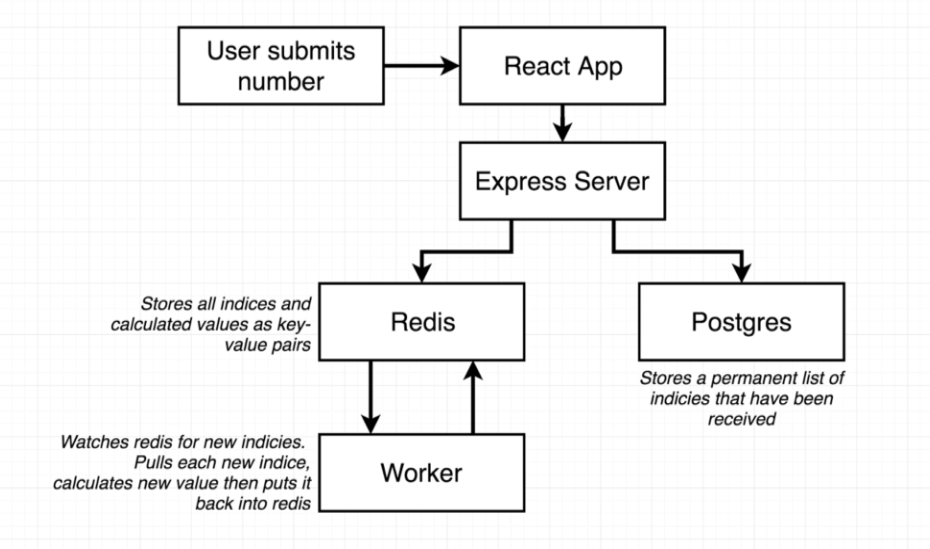

# DevOpsChallenge

## Multi-Container Architecture Application - Project 3

In this project, I will set up a multi-container application ( simple app with complex architecture ) with Reactjs for frontend, Expressjs for backend, Postgres for Database, Redis for caching database, and worker process with expressjs. For the DevOps Automation tools, I will use CI/CD with GitLab, docker for containization, and AWS Elastic BeanStalk for production server.

**gitHub Repo Link** - <https://github.com/Kyawkhaing444/multiDockerApp>

## Production-Grade CI/CD workflow - Project 2

In this project, I have set up a front-end production-grade workflow for Nextjs [ React ] with docker for containerization, Circle ci for continuous integration and deployment, and AWS Elastic Beanstalk for the production server.

* [x] Created custom docker image for nextjs codebase and created volume binding for live updating.
* [x] Created docker-compose file for handling live updating instead of manually instructing to create volume binding in docker run command.
* [x] Set up testing environment
* [x] Set up Circle CI between local and github remote repo
* [X] Set up Elastic Beanstalk for production server
* [X] Set up continuous deployment with circleci between github and production server.

**gitHub Repo Link** - <https://github.com/Kyawkhaing444/nextjs_cicd_workflow>

## Nginx Reverse Proxy Server - Project 1

* Created Nginx reverse proxy server based on ubuntu 20.04 with an AWS EC2 instance.
* Created subdomain and path-based domain for two sub-projects.
* Set up HTTPS with Let's Encrypt
